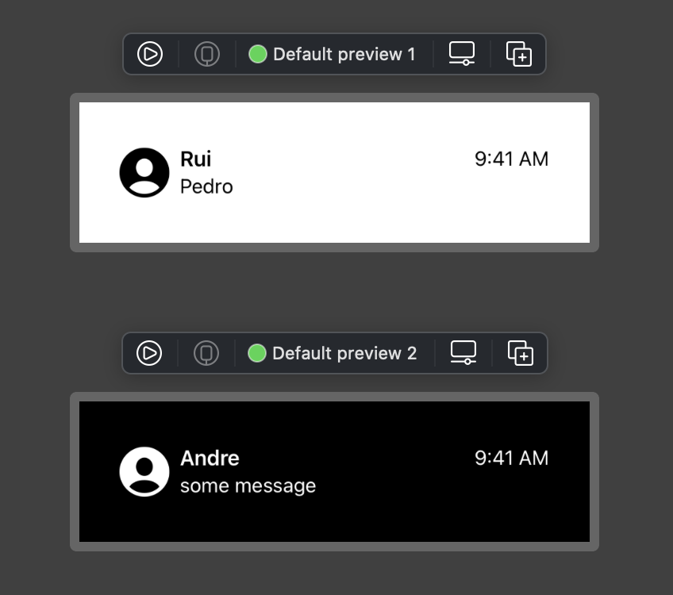

# 👨‍💻 Code

```swift
struct MessageCell: View {
    @State var name: String
    @State var message: String

    var body: some View {
        NavigationLink(destination: MessageView()) {
            HStack {
                Image(systemName: "person.crop.circle.fill")
                    .font(.system(size: 40))

                VStack(alignment: .leading, spacing: 2) {
                    HStack(alignment: .center) {
                        Text(name)
                            .font(.headline)
                        Spacer()
                        Text("9:41 AM")
                            .font(.callout)
                    }

                    Text(message)
                        .font(.callout)
                        .lineLimit(1)
                }
            }
            .padding(.vertical, 12)
        }
    }
}

```

<br/><br/>

# 👩‍🎨 Result

<p align="center">

</p>
